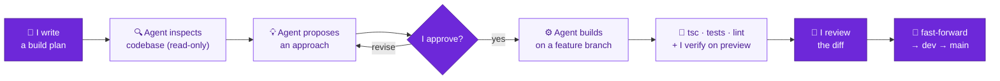

I built **[Loop](./README.md)** with an AI coding agent (Claude Code) as my tool, not my autopilot. The agent wrote most of the code; **the architecture, the reviews, the catches, and the product decisions were mine.** This doc is how I worked — and why I think it's an effective AI-native approach, not just "fast typing."

The short version: I treated the AI like a strong, fast engineer who needs a clear spec, a tight review, and someone accountable for the result. So I gave it plans, made it show its work, checked its output critically, and owned every merge.

## 🔁 My workflow model — plan-first and agentic

The method I chose, and repeated for every non-trivial feature. It's what let me move fast *without* losing control:

> The **purple steps are mine** — writing the spec, the approval gate, the review, the merge. The agent never wrote code until I'd approved a plan, and never reached `main` until I'd verified and reviewed it.

For the bigger features I wrote an explicit build plan with hard rules — "additive only", "don't touch the reducer / fire path", "no fabricated confidence" — had the agent do a **read-only inspection** of the codebase and propose an approach, and only gave the go-ahead once the plan was right. Then it built on a feature branch, I verified on the Vercel preview, read the diff, and merged. Repeatable, and quality stayed high because the expensive decisions happened *before* any code was written.

## 🧭 Decisions & catches that were mine

Concrete moments where my judgment — not the agent's — set the direction.

**1 · I designed a provider-agnostic LLM interface up front.**
Before the agent loop existed, I had it built against a neutral `LLMProvider` contract (`runTurn`, JSON-Schema tools) so the loop never knows which vendor it's talking to. The payoff was real: when **Gemini** hit quota limits and a free **Groq** model underperformed, I moved the live provider to **OpenAI** by changing **one env var** (`LLM_PROVIDER`) — no loop changes, no adapter rewrite. An architecture decision turned a provider problem into a config change.

**2 · I caught a model hallucination by reviewing the agent's reasoning, not just its answer.**
I'd built a live **Activity Trace** that streams each tool call and its real result. Watching it, I saw a smaller free model citing audience sizes that didn't match what the `analyse_audience` tool had actually returned — it was filling gaps with plausible-but-fabricated numbers. I fixed it by forcing **sequential tool calls** (`parallel_tool_calls: false`) so every decision is grounded on the previous tool's real output, and required proposals to cite the numbers they pulled. Trusting AI output blindly is the failure mode; inspecting it is the job.

**3 · When a production bug hid its cause, I diagnosed by instrumentation, not guesswork.**
A campaign fire worked locally but silently failed in production — the funnel never moved. Instead of letting the agent keep adjusting timeouts on a hunch, I directed it to **instrument the CRM→channel dispatch path with explicit request/response logging**. The logs showed the request landing on a service that returned 404 — a **misrouted service URL** pointing at the wrong host. Methodical beats lucky.

**4 · I enforced scope discipline and a single source of truth.**
I decided up front what *not* to build — auth, loyalty/offers, a visual segment builder, live implementations of every LLM adapter — to spend the depth on the agent, the delivery engine, and attribution. Every later feature was **additive**: the Learning Loop and the manual-builder Channel Recommendation both read the *same* `getCampaignLearnings()` source of truth, so the agent and the UI can never disagree on the numbers. I kept the channel service, fire path, attribution, and reducer untouched as features landed.

## ⚖️ Where my judgment steered the AI

- **I approved or rejected plans before code existed.** Example: for the Channel Recommendation I directed it to surface a persona-specific recommendation *only* when exactly one persona is selected — otherwise a claim like "for Dormant customers, RCS converts best" would be misleading on a mixed audience.
- **I insisted on real verification that automated checks miss.** `tsc` and unit tests were green, but previewing the audience in the browser returned **0 customers** — the form was silently AND-ing default filters into every query. Only real-UI verification surfaced it. Green tests are necessary, not sufficient.
- **I chose the tradeoffs.** Last-touch attribution within a 7-day window (clarity over completeness); free-tier cold-start handled with wake + idempotent retry and an honest UI notice rather than pretending it doesn't exist; co-locating the CRM with the database (`bom1`) to cut the avoidable latency. Each is a deliberate call I can defend.
- **I protected production with a branch workflow.** `main` is protected; `dev` is the integration branch; every feature got its own branch and only **fast-forwarded** to `main` after I verified it. Production was never exposed to half-finished work.

## ✅ Takeaway

AI let me build a lot, fast — a two-service system with an agent loop, a real delivery pipeline, attribution, and a learning loop, in a short window. But speed wasn't the point; **control was.** The interface design, the critical reviews, the bug I caught by reading the trace, the diagnosis by instrumentation, and the product tradeoffs were mine. The agent accelerated execution; I supplied the engineering judgment that made the output correct and defensible.

That's what AI-native development looks like when it's done well: not *"the AI built it,"* but *"I directed an AI to build exactly what I'd designed, and I verified every step."*

Loop · AI-native development · built for the Xeno Mini CRM take-home

