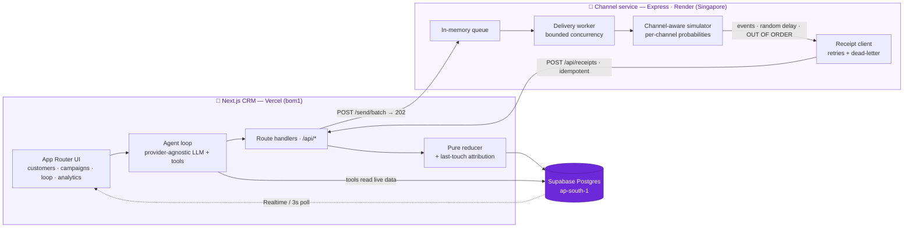

<div align="center">


### Proposes, executes, attributes, and learns from campaigns — with a human in the loop.


<br/>


</div>

### ✨ Highlights

| | |
|:--|:--|
| **🔄 The closed loop** — propose → approve → execute → attribute → **learn**, with a human approving every send. | **📡 A real delivery engine** — queue + worker, out-of-order events, idempotent receipts, retries + dead-letter. |
| **📊 Grounded, confidence-aware learning** — recommendations cite real per-channel numbers; none are invented. | **💰 Revenue attribution** — last-touch within a 7-day window, split into attributed vs organic. |


## 🎯 What is Loop

Marketers at a D2C brand like **StyleArc** spend their day on four questions: *who* to talk to, *what* to say, *which channel* to use, and *did it actually drive revenue?* Most tools answer one or two and leave the loop open — you blast a segment and never learn whether it worked, so the next campaign is just as much of a guess.

**Loop closes that loop.** It's an AI-native mini-CRM built around one opinionated product bet:

> **The agent is the hero, and a human is always in the loop.** Loop doesn't just chat — it reads the live database, *proposes a complete campaign* (audience + message + channel + expected impact) with the data behind its reasoning shown, and waits. The marketer **approves**. Only then does it **execute**. Then it **attributes** the revenue and **learns** from the result, so its intelligence isn't trapped in the chat box — it's woven into the product (e.g. the manual campaign builder gets the same grounded channel recommendation).

```
 PROPOSE ──▶ APPROVE ──▶ EXECUTE ──▶ ATTRIBUTE ──▶ LEARN ──▶ (sharper next PROPOSE)
  agent       human       pipeline     last-touch    grounded
  + reasons   guardrail    + receipts   revenue       in real outcomes
```

<details>
<summary><b>Deliberately <i>not</i> built — scope discipline</b></summary>

<br/>

The brief rewards depth in the right places, so these were conscious cuts — each stated as a tradeoff, not an oversight:

| Not built | Why |
|---|---|
| **Real messaging providers** | Explicitly forbidden by the brief. Channels (WhatsApp / SMS / Email / RCS) are **simulated** by our own channel service — but with *channel-differentiated* outcome probabilities, so channel analytics and the agent's channel choices carry real signal, not noise. |
| **Auth / multi-tenant** | Single-marketer tool. Auth is orthogonal to the product bet and would only add boilerplate. |
| **Loyalty / offers modules, visual segment builder** | Out of scope for the core loop; effort went into the agent, the delivery engine, and attribution instead. |
| **All three LLM adapters live** | The point is the *provider-agnostic interface*. **OpenAI is the live provider; Gemini is live but quota-limited; Anthropic is a typed stub that throws.** Swapping is a one-env-var change. |

</details>

## 🌐 Live demo

| Surface | URL | Notes |
|---|---|---|
| **CRM (Vercel)** | `https://<your-crm>.vercel.app` | Next.js App Router; region-pinned to Mumbai (`bom1`) next to the DB. |
| **Channel service (Render)** | `https://<your-service>.onrender.com/health` | Returns queue depth + throughput metrics. |

> ℹ️ **Cold-start, by design.** The channel service runs on Render's **free tier**, which sleeps after ~15 min idle (~50s to wake). The fire path is hardened for it: the CRM **wakes** the service (`/health` poll) and **retries the batch with backoff**; communications are created **once** and the campaign flips to `SENDING` only **after** the batch is accepted — so a cold-start failure leaves it `APPROVED` and **re-firing is safe and idempotent** (no double-send, no stuck `SENDING`). The UI surfaces a "waking the delivery service…" notice so the wait reads as expected behaviour. *On an always-on host this disappears.* For a smooth demo, hit `/health` once to warm it first.

> 🔒 No secrets live in this repo — only `.env.example` (names, no values). Every real value is set in the Vercel / Render dashboards. Replace the placeholder URLs above with your deployments.


## 🏗️ Architecture

Two services by deliberate design: a **serverless CRM** (stateless, scales to zero) and a **persistent channel service** (holds an in-memory queue, a long-running worker, and lifecycle timers — exactly what serverless can't host).



<details>
<summary><b>Why each major piece is the way it is</b></summary>

<br/>

- **Split services.** The delivery pipeline needs a queue, a worker, and timers that fire over seconds — there's nowhere to hold those in a serverless function. So it's its own Express service, and the CRM stays a clean serverless app.
- **202-accept + async receipts.** `POST /send/batch` returns immediately; the worker emits lifecycle events *later*, *out of order*, via `POST /api/receipts` — mirroring how real providers behave and forcing the system to be ordering-tolerant.
- **Event log + pure reducer.** Receipts append to an immutable event log; status is **derived** from *all* events (max-rank), so duplicates and out-of-order arrivals are correct without special-casing.
- **Realtime with a fallback.** The funnel updates via Supabase Realtime, with automatic **3s polling** fallback behind a flag — never a blank screen.

</details>

## 🧩 Key features

### 1 · Agentic proposals with explainable reasoning + a live Activity Trace

The agent (`lib/agent/loop.ts`) is **provider-agnostic** and dependency-injected, so it's identical across vendors and unit-testable with a mock provider. Each turn it asks the model, runs any requested tools (Zod-validated, errors caught), feeds the results back, and loops — bounded by `MAX_TURNS`. It never fires anything: `propose_campaign` persists a `PROPOSED` campaign for the human to approve. A **live Activity Trace** streams every step over SSE so you can *watch* it reason.

<details>
<summary><b>The agent's tools, the live trace & anti-hallucination design</b></summary>

<br/>

| Tool | What it does |
|---|---|
| `analyse_audience` | Sizes & profiles a segment from the live DB (count, avg LTV, persona mix). |
| `get_campaign_learnings` | **Primary grounding** — real per-channel conversion + revenue with sample sizes & confidence. |
| `get_past_performance` | Aggregated channel outcomes + attributed-vs-organic revenue. |
| `draft_message` | On-brand StyleArc copy with `{name}` / `{offer}` placeholders. |
| `propose_campaign` | Persists the proposal (audience + message + channel + expected impact + cited reasoning). |

The **Activity Trace** streams each tool call, its real one-line result, retries, and the model's between-step narration over SSE (`/api/agent`). It's a pure fold (`trace.ts`) used identically server- and client-side, reached via an `AsyncLocalStorage` bus — so it required **zero changes to the LLM interface**.

**Anti-hallucination:** tool calls run **sequentially** (`parallel_tool_calls: false`) so the model grounds each decision on the previous tool's *real* result before the next, and the proposal's `reasoning.dataPoints` must cite the actual numbers it pulled. Result: the agent proposes *"RCS converts best for dormant customers at X%"* because the data says so — not because it guessed.

</details>

### 2 · A genuinely engineered channel / delivery service

The system-design centrepiece — a real async pipeline, not a `setTimeout` toy: a queue drained by a bounded-concurrency worker, channel-differentiated simulation, out-of-order lifecycle events, idempotent receipts reconciled by a pure state machine, retries with exponential backoff, and a dead-letter for anything that can't be delivered.

<details>
<summary><b>Engineering details + endpoints</b></summary>

<br/>

| Capability | Implementation |
|---|---|
| **Queue + worker** | In-memory FIFO drained by a `DeliveryWorker` with **bounded concurrency** (`WORKER_CONCURRENCY`, default 8). |
| **Channel-aware simulation** | Per-channel probability profiles (`CHANNEL_PROFILES`) → WhatsApp/SMS/Email/RCS genuinely differ, so analytics has signal. |
| **Out-of-order async lifecycle** | Each message's events (`SENT → DELIVERED → … → CONVERTED`, or `FAILED`) are scheduled as independent timers with random delays (2–10s) → receipts **arrive out of order**. |
| **Idempotent receipts** | `providerEventId` is `UNIQUE`; a duplicate is deduped, but status is **re-derived on every receipt** — so a retry *heals* a stuck communication. |
| **Reconciling state machine** | Pure `deriveStatus()` takes the **max rank** over the full event log; `FAILED` is terminal *unless* a later event proves delivery. Ordering- and duplicate-proof by construction. |
| **Retries + dead-letter** | Receipt callbacks retry **4× with exponential backoff** (0.5/1/2/4s); permanent 4xx or exhausted retries → **dead-letter** (`GET /dead-letter`) so nothing is silently lost. |
| **Backpressure** | Bounded in-flight receipt concurrency (`RECEIPT_CONCURRENCY`) so a campaign-sized burst can't exhaust the CRM's DB pool. |
| **Observability** | `GET /health` exposes queue depth + throughput metrics (`eventsScheduled`, `eventsDeliveredOk`, `eventsRetried`, `eventsDeadLettered`). |

```
POST /send          → 202, enqueue a single send
POST /send/batch    → 202, a campaign of up to 5000 (independent per-recipient timelines)
POST /stress?count=N→ provision N real communications in the CRM, then drain them
GET  /health        → status, queue depth, metrics, dead-letter size
GET  /dead-letter   → receipts that exhausted retries
```

`POST /stress?count=N` (also surfaced via the CRM's `/api/stress`) provisions and drains N real communications end-to-end — used to verify the pipeline under load with `eventsDeadLettered` staying at ~0.

</details>

### 3 · Last-touch revenue attribution

When a communication reaches `CONVERTED`, the receipt handler creates **exactly one** attributed `Order` (amount anchored on the customer's historical AOV) and bumps the customer's LTV — atomically, inside a short transaction, idempotent against retries. Revenue rolls up per **campaign / channel / segment**, split into **attributed vs organic**.

> **Tradeoff (stated):** real attribution weighs multiple touches and de-dups across overlapping campaigns. Loop credits the single **last** converting communication within a **7-day window** (`ATTRIBUTION_WINDOW_DAYS`) — defensible for a single-marketer CRM and easy to reason about in a review.

### 4 · The Learning Loop

`lib/learnings.ts` (pure, unit-tested) + `lib/learnings-data.ts` turn real fired-campaign outcomes into a **confidence-aware** model: per-channel conversion % and attributed revenue **with sample sizes**, a `lowConfidence` flag (needs ≥2 campaigns *and* ≥30 sends to be "confident"), best/worst channel, and the strongest **persona×channel** signal (surfaced only past a sample guard). It's the single source of truth behind both the `get_campaign_learnings` tool **and** the *"What Loop learned"* UI panel — so the marketer sees exactly the numbers the agent grounded on. On a cold start it says so honestly instead of inventing a recommendation.

### 5 · Channel Recommendation in the manual builder

Intelligence at the point of *manual* decision. In `/campaigns/new`, a pure `recommendChannel()` (same learnings model — no forked aggregation) advises the best channel with a one-line reason and a confidence level: it prefers the **persona×channel** signal when a single persona is selected and grounded, falls back to the overall best, and shows a neutral cold-start state otherwise. One click sets the channel; the marketer can always override. *Advice, not automation.*


## ⚖️ System design & tradeoffs

The honest "I'd do X at scale, but did Y for this scope" calls — all reflected in the code:

| Decision | This build | At scale |
|---|---|---|
| **Delivery durability** | In-memory queue + dead-letter (lost on restart). | BullMQ/Redis or SQS with a durable DLQ — the worker abstraction maps directly. |
| **Free-tier channel host** | Render free tier → ~50s cold start, handled with wake + idempotent retry. | Always-on host; dial the wait/timeouts to ~0 and fires are instant. |
| **Serverless DB connections** | Pooled Prisma URL (`?pgbouncer=true&connection_limit=1`) so concurrent functions don't exhaust the Supabase pooler; direct URL only for migrations. | Same pattern; add read replicas / a data layer if needed. |
| **Latency / region** | CRM pinned to **Mumbai `bom1`** next to Supabase `ap-south-1`; Render in Singapore. Receipt pipeline hardened for high latency (bounded concurrency + 20s interactive-tx timeout, env-tunable). | Co-locate all three; the receipt path already tolerates the rest. |
| **Attribution** | Last-touch, 7-day window — clarity over completeness. | Multi-touch with overlap de-dup. |
| **LLM providers** | Provider-agnostic interface; OpenAI live, Gemini live (quota-limited), Anthropic a typed stub. | Implement the remaining adapters — the loop doesn't change. |

## 🧰 Tech stack

**CRM** Next.js 16 (App Router, RSC + route handlers) · React 19 · TypeScript 5 (strict) · Tailwind v4 + Radix primitives (shadcn-style) + lucide · Recharts · Prisma 6 · Supabase Postgres + Realtime · Zod
**Channel service** Node + Express 4 · TypeScript · Zod
**LLM** provider-agnostic adapter (OpenAI / Groq via one OpenAI-compatible adapter, Gemini, Anthropic stub), server-side keys only
**Content Studio images** via a provider-agnostic `ImageProvider` — for this build, creative is served from a **curated on-brand library** (honestly labelled, never implied as live generation); a real image model swaps in behind the same interface, exactly like the LLM adapters
**Tooling** npm workspaces monorepo · Vitest · ESLint · `tsx`
**Hosting** Vercel (CRM) · Render (channel service) · Supabase (DB)

<details>
<summary><b>Project structure</b></summary>

<br/>

```
xeno-loop/
├── apps/
│   ├── crm/                          # Next.js 16 — UI + API + agent + data layer
│   │   ├── prisma/                   # schema.prisma + seed.ts (200 customers · 5 personas)
│   │   └── src/
│   │       ├── app/                  # routes: /, /customers, /campaigns, /loop, /analytics, /api/*
│   │       ├── components/           # shadcn-style UI + agent-trace, funnel, learnings/recommendation panels
│   │       └── lib/
│   │           ├── agent/            # loop.ts · tools.ts · agent.ts · trace.ts · trace-bus.ts
│   │           ├── llm/              # types.ts (interface) + openai · gemini · anthropic adapters
│   │           ├── reducer.ts        # pure, out-of-order/idempotent state machine
│   │           ├── receipts.ts       # idempotent receipt handler (dedupe + self-heal)
│   │           ├── attribution.ts    # last-touch, 7-day window
│   │           ├── analytics.ts      # channel performance + insights
│   │           └── learnings.ts      # confidence-aware learnings + recommendChannel
│   └── channel-service/              # Express delivery sim
│       └── src/                      # server.ts · queue.ts · simulator.ts · receipts-client.ts · state.ts · config.ts
├── .env.example                      # all env var NAMES (no values)
├── render.yaml                       # Render Blueprint for the channel service
├── vercel.json                       # region pin: bom1
├── DEPLOY.md · PROGRESS.md · CLAUDE.md
└── README.md
```

</details>

**Tested cores** (`npm test`) cover the parts that must not silently break: the **reducer** (out-of-order + idempotent), **funnel math**, the **learnings + recommendation** logic, the **segment filter**, the **agent loop** (mock provider), the **activity-trace** fold, and the channel service's **receipt client** + **simulator**.

## ⚡ Getting started

> Secrets are referenced by **name** only — copy `.env.example` and fill values locally; never commit real values.

```bash
npm install                 # installs both workspaces; postinstall runs `prisma generate`

cp .env.example .env        # then fill in your values (see the table below)

npm run db:migrate          # apply Prisma migrations
npm run db:seed             # seed 200 customers across 5 personas

# two terminals:
npm run dev:crm             # Next.js CRM on :3000
npm run dev:channel         # Express channel service on :4000

npm test                    # run unit tests across both workspaces
```

<details>
<summary><b>Environment variables</b> (names only — see <code>.env.example</code>)</summary>

<br/>

| Name | Purpose |
|---|---|
| `DATABASE_URL` / `DIRECT_URL` | Supabase pooled (runtime) / direct (migrations) Postgres URLs. |
| `NEXT_PUBLIC_SUPABASE_URL` / `NEXT_PUBLIC_SUPABASE_ANON_KEY` | Browser Supabase client for Realtime. |
| `LLM_PROVIDER` | `openai` (live) · `groq` · `gemini` · `anthropic` (stub). |
| `OPENAI_API_KEY` / `OPENAI_MODEL` | Live LLM (`gpt-4.1-mini`), server-side only. |
| `GROQ_API_KEY` / `GROQ_MODEL`, `GEMINI_API_KEY` / `GEMINI_MODEL` | Alternative providers (selectable). |
| `CHANNEL_SERVICE_URL` / `CRM_RECEIPTS_URL` | The two services' addresses of each other. |
| `NEXT_PUBLIC_REALTIME_ENABLED` | `true` → Supabase Realtime funnel; else 3s polling. |

</details>

Full deployment walkthrough (Render → Vercel → wire-back, env tables, gotchas) is in **[`DEPLOY.md`](./DEPLOY.md)**.

## 🤖 How this was built

Loop was built with heavy use of an AI coding agent (Claude Code) — agentic, plan-first, with the human reviewing and approving every step. See **[`AI-WORKFLOW.md`](./AI-WORKFLOW.md)** for how AI was used: the planning loop, the read-only-inspect-then-propose discipline, and where human judgment steered the build.

<div align="center">


<sub>Loop · an AI marketing co-pilot · built for the Xeno Mini CRM take-home</sub>

</div>
